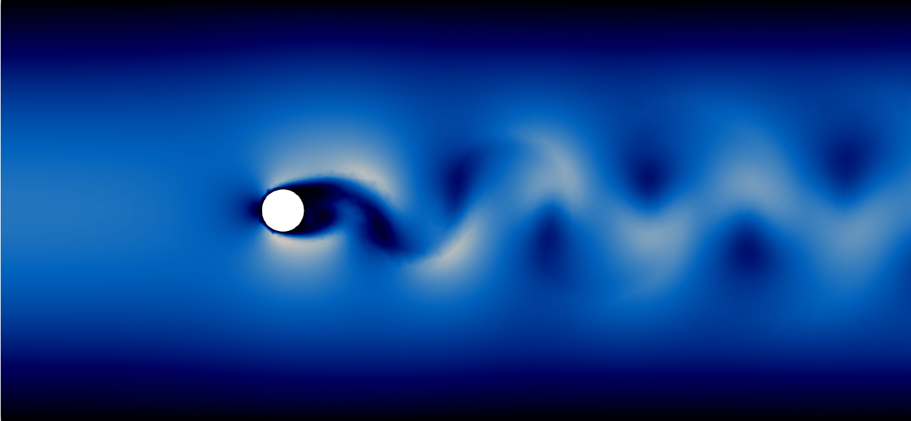

# Introduction 

$$\dot x = f(x) + Bu$$

---

## {data-background-image="pics/dbrc-v_Re50_stst_cm-bbw.png" data-background-size="cover"}

```
data-background-size="cover"
# spreads the background image over the whole window (default option)
```

<br>
<br>
<br>
<br>
<br>
<br>
<br>

. . .

::: {style="position: absolute; width: 60%; right: 0; box-shadow: 0 1px 4px rgba(0,0,0,0.5), 0 5px 25px rgba(0,0,0,0.2); background-color: rgba(0, 0, 0, 0.9); color: #fff; padding: 20px; font-size: 40px; text-align: left;"}

Stabilization of a laminar flow

 * 50'000 degrees of freedom
 * but linear regulator.

```
:::
# fenced blocks for custom styles
:::
```

:::

## Control of Nonlinear & Large-Scale Systems

A general approach would include

 * powerful backends (linear algebra / optimization)
 * exploitation of general structures
 * data-driven surrogate models
 * all of it?!


# LPV Representation

$$
\dot x = f(x) \approx A(x)\,x \approx [A_0+\Sigma \,\rho_k(x)A_k]\, x
$$

---

Consider an ODE with $x(t)\in \mathbb R^n$ and some $\beta \in \mathbb R^n$:

$$\dot x = (x\cdot \beta )\, x.$$

. . .

In a *reduced order model* with left projection matrix $\tilde V\in \mathbb R^{n,r}$: 
$$ x \approx \tilde x = \tilde V\rho = \Sigma_{i=1}^r \tilde V_i \rho_i$$

. . .

```
. . .  # makes the *beamer pause*
``` 


# Low-dimensional LPV for NSE

**LPV Approximation** of *Navier-Stokes Equations* by *POD* and *Convolutional Neural Networks*

---


## {data-background-image="pics/cw-Re60-t161-cm-bbw.png" data-background-size="100%"}

```
data-background-size="100%"  # scales the background image with the window size
```

<br>
<br>
<br>

. . .

::: {style="position: absolute; width: 60%; right: 0; box-shadow: 0 1px 4px rgba(0,0,0,0.5), 0 5px 25px rgba(0,0,0,0.2); background-color: rgba(0, 0, 0, 0.9); color: #fff; padding: 20px; font-size: 40px; text-align: left;"}
The *Navier-Stokes* equations

$$
\dot v + (v\cdot \nabla) v- \frac{1}{\mathsf{Re}}\Delta v + \nabla p= f, 
$$

$$
\nabla \cdot v = 0.
$$

:::

---



\begin{align}
\dot v + (v\cdot \nabla) v- \frac{1}{\mathsf{Re}}\Delta v + \nabla p&= f, 
\nabla \cdot v &= 0.
\end{align}


# Conclusion

## ... and Outlook

 * Can also do citations like [@ApkGB95]

 * They go to the last slide


. . .

Thank You!

---

## References
